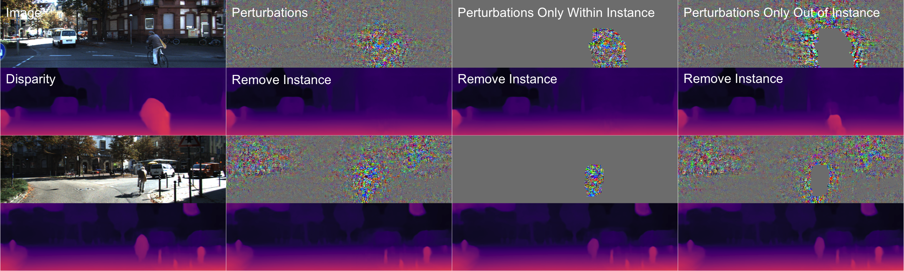

# Targeted Adversarial Perturbations for Monocular Depth Prediction

PyTorch implementation of *Targeted Adversarial Perturbations for Monocular Depth Prediction*

\[[arxiv](https://arxiv.org/pdf/2006.08602.pdf)\] \[[poster](http://web.cs.ucla.edu/~alexw/nips2020_targeted_adversarial_monodepth_poster.pdf)\]

Published in the Proceedings of Neural Information Processing Systems (NeurIPS) 2020

Authors: [Alex Wong](http://web.cs.ucla.edu/~alexw/), [Safa Cicek](https://bsafacicek.github.io/)

If this work is useful to you, please consider citing our paper:
```
@inproceedings{wong2020targeted,
  title={Targeted Adversarial Perturbations for Monocular Depth Prediction},
  author={Wong, Alex and Safa Cicek and Soatto, Stefano},
  booktitle={Advances in neural information processing systems},
  year={2020}
}
```

**Table of Contents**
1. [About targeted adversarial perturbations](#about-targeted-adversarial-perturbations)
2. [Setting up your virtual environment](#setting-up-virtual-environment)
3. [Setting up your data directories](#setting-up-data-directories)
4. [Setting up pretrained models](#setting-up-pretrained-models)
5. [Optimizing targeted adversarial perturbations](#optimizing-targeted-adversarial-perturbations)
6. [Broader impact](#broader-impact)
7. [License and disclaimer](#license-disclaimer)

## About targeted adversarial perturbations <a name="about-targeted-adversarial-perturbations"></a>

<p align="center">
    
</p>

A number of studies have shown that classification, detection and segmentation outputed by a deep network, can be dramatically altered by small additive signals. These *adversarial perturbations* are designed on purpose to “fool” the network. We explore the possibility of fooling a network into inferring the wrong depth of a scene. More specifically, we show that *not only* is it possible to fool a network to provide the wrong depth map, but it is possible to fool it to return *any* depth map. Targeted adversarial perturbations are designed not just to return the wrong answer, but to return the answer that the *adversary wants*.

For example, in the figure above, visually imperceptible noise can (i) scale the scene 10% closer to the camera, (ii) scale the vehicles 10% closer, and (iii) remove an instance of a vehicle from the scene.

<p align="center">
    
</p>

Our work sheds light on the role of context in the representation of geometry with deep networks. When attacking a specific category or instance, while most of the perturbations are localized, some are distributed throughout the scene, far from the object of interest. Even when the target effect is localized (e.g., make a car disappear), the perturbations are non-local, indicating that the network exploits non-local context, which represents a vulnerability. This begs the question: could one perturb regions in the image, for instance displaying billboards, thus making cars seemingly disappear?

We hope that our repository can provide you with the tools to study and further explore these phenonmenons -- ultimately to develop more robust representations of geometry.


## Setting up your virtual environment <a name="setting-up-virtual-environment"></a>
```
virtualenv -p /usr/bin/python3 targeted-attacks-py3env
source targeted-attacks-py3env/bin/activate
pip install opencv-python scipy scikit-learn scikit-image matplotlib future yacs gdown
pip install numpy==1.16.4 gast==0.2.2
pip install tensorflow-gpu==1.14
```

## Setting up your data directories <a name="setting-up-data-directories"></a>
Assuming you have the KITTI semantics dataset:

```
mkdir data
ln -s /path/to/kitti_data_semantics/ data/kitti_data_semantics
python setup/setup_dataset_kitti_semantics.py
python setup/setup_dataset_kitti_instance.py
```

## Setting up pretrained models <a name="ssetting-up-pretrained-models"></a>
We have provided the implementations of Monodepth, Monodepth2, and PackNet in `external_src`. The implementation of Monodepth was written by us and follows closely to the official Tensorflow implementation. Each model can be accessed through a wrapper class (e.g. `src/monodepth2_model.py`, `src/packnet_model.py`).

We have the copy of each pretrained model used into our Google drive to download them, you may use gdown (already installed in virtual environment):

```
python setup/setup_model_monodepth.py
python setup/setup_model_monodepth2.py
python setup/setup_model_packnet.py
```

If you are unable to download them via our provided setup scripts, you can directly access them using the following Google drive links:

```
Monodepth :
https://drive.google.com/file/d/1yJ8wx9khv-pg-D_UQIrvAAWW3zsM3OGA/view?usp=sharing

Monodepth2 :
https://drive.google.com/file/d/1ArW1Tr9-Clukepy0_olWw8AHMbigOXTH/view?usp=sharing

PackNet :
https://drive.google.com/file/d/1PLeCOMZjki6XSJmGPOF2Tc2iRvKMIBN4/view?usp=sharing
```

Each of the links will give you a `.zip` file (`resnet50.zip`, `stereo_640x192.zip`, `packnet_velsup_csk.zip`), please create the appropriate directories when unzipping them:
```
mkdir pretrained_models

mkdir pretrained_models/monodepth
unzip -o path/to/monodepth/resnet50.zip -d pretrained_models/monodepth/

mkdir pretrained_models/monodepth2
unzip -o path/to/monodepth2/stereo_640x192.zip -d pretrained_models/monodepth2/

mkdir pretrained_models/packnet
unzip -o path/to/packnet/packnet_velsup_csk.zip -d pretrained_models/packet/
```

## Optimizing targeted adversarial perturbations <a name="optimizing-targeted-adversarial-perturbations"></a>
You can run targeted attacks against each model using `src/run_perturb.py`.

For example, to fool Monodepth2 into scaling the entire scene 10% farther away:
```
python src/run_perturb.py \
--image_path testing/kitti_semantic_test_vehicle_image.txt \
--n_height 192 \
--n_width 640 \
--n_channel 3 \
--output_norm 0.02 \
--n_step 500 \
--learning_rates 5.0 1.0 \
--learning_schedule 400 \
--depth_method monodepth2 \
--depth_transform_func multiply \
--depth_transform_value 1.10 \
--mask_constraint none \
--checkpoint_path perturbations/monodepth2/all_mult110_norm002_lr5e0_1e0 \
--depth_model_restore_path0 pretrained_models/monodepth2/stereo_640x192/encoder.pth \
--depth_model_restore_path1 pretrained_models/monodepth2/stereo_640x192/depth.pth \
--device gpu
```

Note: `testing/kitti_semantic_test_vehicle_image.txt` contains the complete 200 images from KITTI semantics dataset.

Additional examples of different attacks (e.g. symmetric flipping, instance removal) can be found in the `bash` directory. To run them:
```
bash bash/run_perturb_monodepth.sh
bash bash/run_perturb_monodepth2.sh
bash bash/run_perturb_packnet.sh
```

## Broader impact <a name="broader-impact"></a>
Adversarial perturbations highlight limitations and failure modes of deep networks. They have captured the collective imagination by conjuring scenarios where AI goes awry at the tune of imperceptible changes. Some popular media and press has gone insofar as suggesting them as proof that AI cannot be trusted.

While monocular depth prediction networks are indeed vulnerable to these attacks, we want to assure the reader that these perturbations cannot cause harm outside of the academic setting. As mentioned in the paper, optimizing for these perturbations is computationally expensive and hence it is infeasible to craft these perturbations in real time. Additionally, they also do not transfer; so, we see little negative implications for real-world applications. However, the fact that they exist implies that there is room for improvement in the way that we learn representations for depth prediction.

Hence, we see the existence of adversaries as an opportunity. Studying their effects on deep networks is also the first step to render a system robust to such a vulnerability. The broader impact of our work is to understand the corner cases and failure modes in order to develop more robust representations. This, in turn, will improve interpretability (or, rather, reduce nonsensical behavior). In the fullness of time, we expect this research to pay a small contribution to benefit transportation safety.

## License and disclaimer <a name="license-disclaimer"></a>
This software is property of the UC Regents, and is provided free of charge for research purposes only. It comes with no warranties, expressed or implied, according to these [terms and conditions](license). For commercial use, please contact [UCLA TDG](https://tdg.ucla.edu).